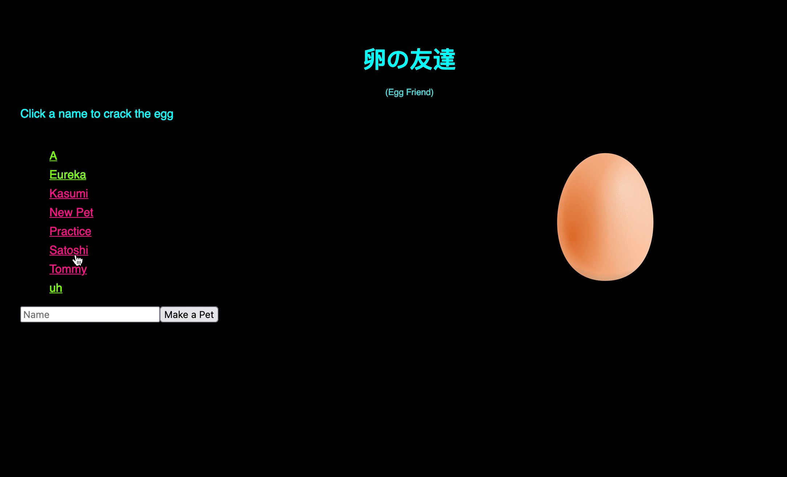

# Tamagotchi Front End

<!--  -->

There were two parts to this assignment:
(1) Create an api for a virtual pet (like a tamagotchi)
(2) Create a front-end using the api

Users can play with, feed, or scold pets, as well as create and delete pets. Playing, feeding, and scolding affects the happiness and hunger of pets.

The front end was done in javascript using React (with hooks) and axios.
